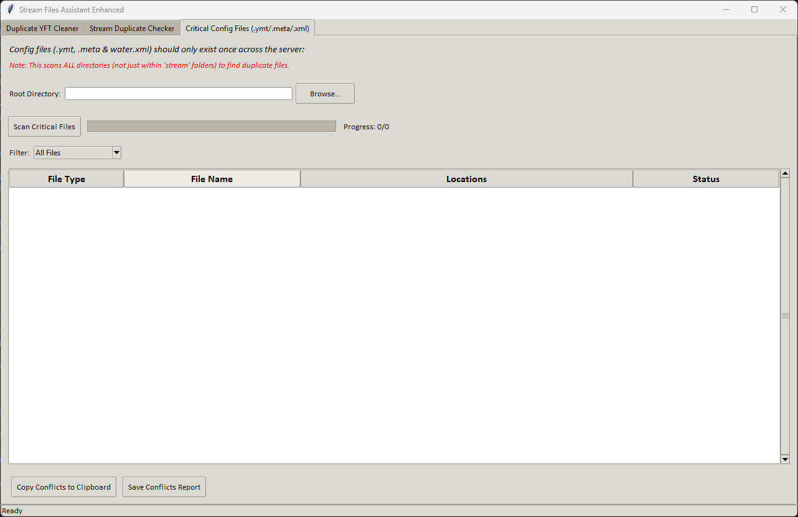

# Stream File Assistant 'Extended'

## Introduction

Firstly full credit goes to the original creator ([PG / st860923](https://github.com/st860923)).
This is a fork of ([his project here](https://github.com/st860923/StreamFileAssistant)), which I have just added some extra functionality to suit my own personal needs and workflow, working on multiple servers.

In the past, missing medium LODs often caused crashes, forcing many creators to manually duplicate files and append `_hi` to make things work. 

Big thanks to **packfile** ([fix for crashes when no medium LOD exists](https://github.com/citizenfx/fivem/pull/2965)), this workaround is no longer necessary, saving significant file space.

This tool, written in Python and then packaged to .exe, is designed to identify and help clean up extras and duplicate files, helping you optimize your stream resources. :smile:

---

## Features

### 1. Duplicate YFT Cleaner
- Specifically designed to clean up duplicate-pasted files.
- Scans for and identifies `_hi` YFT files that were created as a workaround for missing medium LODs.
- Provides tools to select, review, and delete unnecessary duplicates.
- What is size margin?
  - Allows you to define a margin (in KB) for file size comparison when _hi files differ slightly from their counterparts.

### 2. Stream Duplicate Checker
- Checks all `stream` directories for duplicate files, regardless of extension (Now includes .ynd and .ynv).
- Allows users to quickly locate files and their duplicate directories via right-click context menu.
- Simplifies the process of managing large resource libraries.

### 2a. Manual File List Checker
- Paste an external file list into a text area and check whether those files exist in the specified Stream root directory.
- The tool will compare each file name in your list against the files found in the stream directories.
- If a file is found only once, its absolute path is shown.
- If multiple copies exist, all locations are listed under a duplicate label.
- If a file is not found, it is marked as **NOT FOUND**.

### 3. Critical Config File Checker
- Checks all `root` directories for specific duplicate files which can only exist once across a server (sp_manifest.ymt, doortuning.ymt, scenario ymts, gta5.meta etc.) .
- Allows users to quickly locate files and their duplicate directories via right-click context menu.
- Can toggle between all files or only conflicts.
---

## Before You Proceed

**Always BACK-UP everything you plan to modify!** It’s a good habit to avoid any unintended issues.

---

## Screenshots

### 1. Duplicate YFT Cleaner

*Identify and manage duplicate YFT files with ease.*

### 2. Stream Duplicate Checker

*Locate asset file conflicts in stream directories.*

### 2a. Manual File List Checker

*Paste your file list and verify duplicates or missing files in the stream directory.*

### 3. Critical Config File Duplicate Checker

*Locates to critical file conflicts in root directories.*

---

## Contributions

I probably won't PR my changes back to PG's tool as I have removed some translations (Taiwanese Mandarin) and added alot of different functionality so if you want to contribute and improve this version of the tool, feel free to fork this repository and submit a pull request. Otherwise fork PG's version and pull request it there.

---

## Acknowledgments

This tool was originally made by ([PG / st860923](https://github.com/st860923)). So full acknowledgement goes to him.

And also inspired by and references the FiveM project.
- GitHub Repository: [citizenfx/fivem](https://github.com/citizenfx/fivem/blob/master/code/components/citizen-server-impl/src/ResourceStreamComponent.cpp)

---
