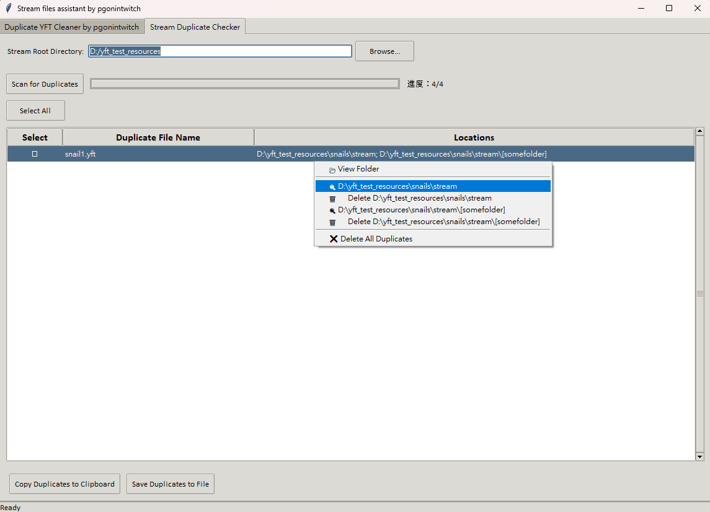
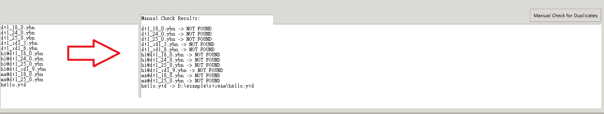

# Stream file Management Assistant

## Introduction

In the past, missing medium LODs often caused crashes, forcing many creators to manually duplicate files and append `_hi` to make things work. 

Big thanks to **packfile** ([fix for crashes when no medium LOD exists](https://github.com/citizenfx/fivem/pull/2965)), this workaround is no longer necessary, saving significant file space.

This tool, using Python and packaged to exe, is designed to clean up those extra, now unnecessary files, helping you optimize your stream resources. :smile:

---

## Features

### 1. Duplicate YFT Cleaner
- Specifically designed to clean up duplicate-pasted files.
- Scans for and identifies `_hi` YFT files that were created as a workaround for missing medium LODs.
- Provides tools to select, review, and delete unnecessary duplicates.
- What is size margin?
  - Allows you to define a margin (in KB) for file size comparison when _hi files differ slightly from their counterparts.

### 2. Stream Duplicate Checker
- Checks all `stream` directories for duplicate files, regardless of extension.
- Allows users to quickly locate files and their duplicate directories via right-click context menu.
- Simplifies the process of managing large resource libraries.

### 3. Manual File List Checker
- **New!** You can now paste an external file list into a text area and check whether those files exist in the specified Stream root directory.
- The tool will compare each file name in your list against the files found in the stream directories.
  - If a file is found only once, its absolute path is shown.
  - If multiple copies exist, all locations are listed under a duplicate label.
  - If a file is not found, it is marked as **NOT FOUND**.
---

## Before You Proceed

**Always back up everything you plan to modify!** It’s a good habit to avoid any unintended issues.

---

## Screenshots

### Duplicate YFT Cleaner

*Identify and manage duplicate YFT files with ease.*

### Stream Duplicate Checker

*Locate and resolve file collisions in stream directories.*

### Manual File List Checker

*Paste your file list and verify duplicates or missing files in the stream directory.*

---

## Contributions

We welcome contributions to improve this tool! Feel free to fork the repository and submit a pull request.

---

## Acknowledgments

This tool was inspired by and references the FiveM project.
- GitHub Repository: [citizenfx/fivem](https://github.com/citizenfx/fivem/blob/master/code/components/citizen-server-impl/src/ResourceStreamComponent.cpp)

---

For any questions or support, feel free to contact me.
